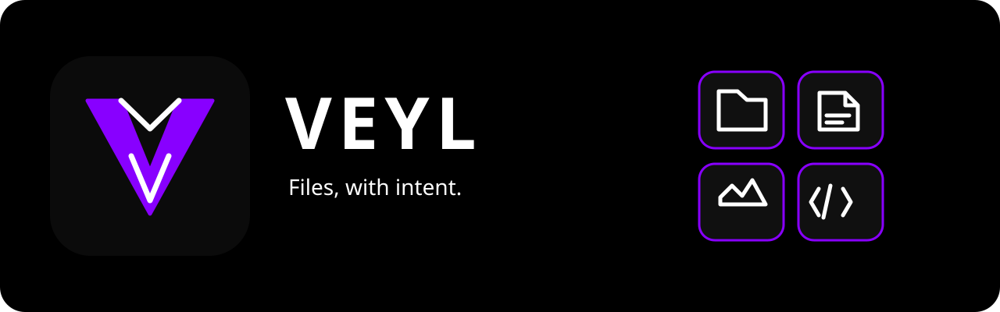
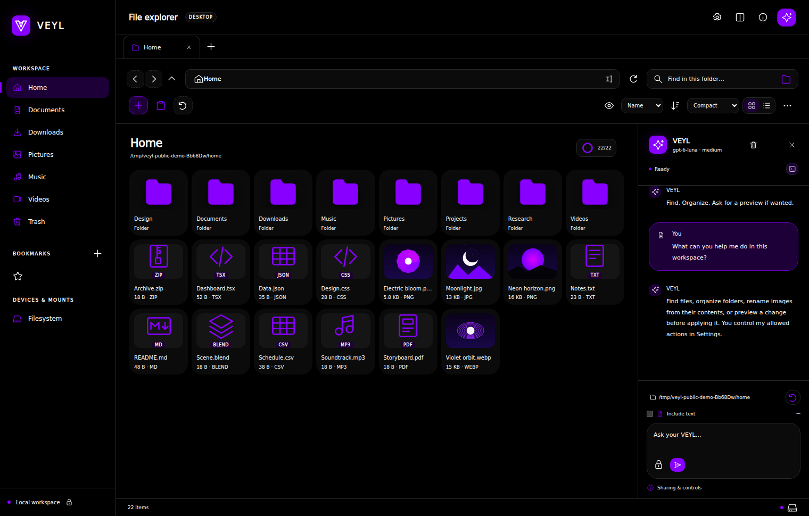
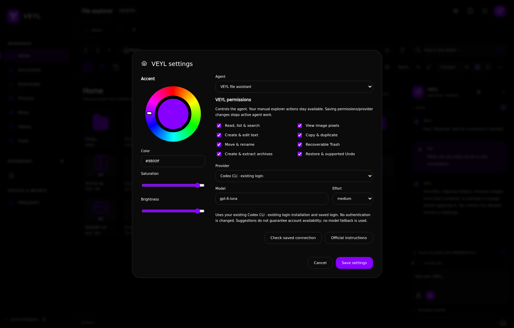
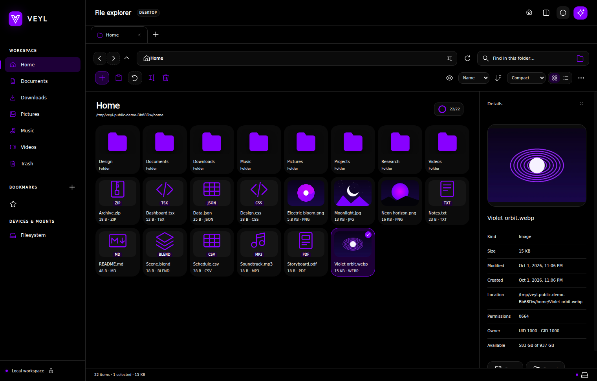

# VEYL

**A visual Linux file explorer with an AI assistant that can act on your instructions.**

Browse a spacious black workspace, preview your files, and ask VEYL to find, organize or rename them. Your chosen model proposes structured actions; the app validates and executes those actions locally. You can stop a request, inspect its actual results and undo supported changes.

[Download releases](https://github.com/SketchOTP/VEYL/releases) · [Privacy](PRIVACY.md) · [Security](SECURITY.md) · [Changes](CHANGELOG.md) · [Report an issue](https://github.com/SketchOTP/VEYL/issues)



Screenshots show the actual app with synthetic files and a demo conversation; they contain no personal files.

## Built for your files

| Explore | Work with files | Ask VEYL |
| --- | --- | --- |
| Tabs, dual panes, breadcrumbs and bookmarks | Copy, move, rename, duplicate and batch naming | Find files and organize matching sets |
| Grid or details, density controls and natural sorting | OS file clipboard and desktop drag/drop | Rename images from their actual pixels |
| Lazy thumbnails, safe previews and properties | ZIP/TAR/TAR.GZ creation and guarded extraction | Create folders/files and replace bounded UTF-8 text |
| Hidden files, mounted volumes and scoped search | Recoverable Trash and conflict-safe restore | View, sort and navigate through natural requests |

Distinct vectors identify a broad built-in catalog of known file types. Newly encountered ordinary extensions can receive a cached AI-designed icon in the background; images retain their real thumbnails. A loaded/total ring shows how much of the current folder is displayed.

Clear commands execute directly. **Preview**, **proposal** and **dry run** requests stay unexecuted. Advice and description requests are read-only. No arbitrary model-generated shell command or native model tool is exposed.

## Install on Ubuntu

VEYL 1.0 is verified on **Ubuntu 24.04 on x86-64**, with Python **3.12+**, GNU coreutils **9.4+**, xdg-utils and the usual Electron desktop libraries. Newer systems may work but are unverified, as are other distributions, architectures and older Ubuntu releases.

### Debian package

Download `VEYL-1.0.0-x64.deb` from the release, then:

```bash
sudo apt install ./VEYL-1.0.0-x64.deb
```

Launch **VEYL** from the application drawer. The package includes Electron and installs its own root-owned Chromium sandbox helper under `/opt/VEYL`. It does not alter an existing Chrome helper, relax system security policy or restart a running copy. Dependencies are declared in the package.

### Portable archive

Extract `VEYL-1.0.0-x64.tar.gz`, open the extracted directory and run:

```bash
./launch-veyl
```

No separate Node.js installation is required. Portable use requires an **existing root:root, mode4755 Chromium helper** with a secure parent chain. The launcher checks a secure bundled helper and `/opt/google/chrome/chrome-sandbox`, or validates an explicit absolute `CHROME_DEVEL_SANDBOX`. It stops clearly when no trusted helper exists. Prefer the Debian package in that case; never use `--no-sandbox` or change system helper permissions to work around a failure.

The packaged `veyl` app-drawer entry and `launch-veyl` portable entry are the same secure wrapper; both launch the bundled `veyl-bin` executable after validation. Do not run `veyl-bin` directly.

The app does not register itself as your default file manager. The Debian package supplies app-drawer integration; source checkouts can additionally install user-local desktop shortcuts as described below.

## Choose your connection

Open the **gear** to select a provider, model and supported reasoning effort. The default remains **Codex CLI · gpt-6-luna · medium**, using your existing Codex login. VEYL finds installed CLIs in the desktop PATH and `~/.local/bin`; it never signs you in automatically, extracts OAuth tokens or changes global CLI settings.

| Connection | Authentication | Release validation boundary |
| --- | --- | --- |
| Codex CLI | Your existing saved ChatGPT/Codex login | Live file actions, image vision and text edit/Undo verified |
| Claude CLI | Your existing supported personal Pro/Max OAuth login | Native isolation/auth-status capability and protocol fixtures; subscribed inference not verified |
| OpenAI API | Your own OpenAI key entered in Settings | Protocol fixtures; no live API-key inference claimed |
| Anthropic API | Your own Anthropic key entered in Settings | Protocol fixtures; no live API-key inference claimed |
| Gemini API | Your own Google AI key entered in Settings | Protocol fixtures; no live API-key inference claimed |

**Check saved connection** checks CLI installation/login or API-key configuration; it does not run a paid model request or guarantee model availability. Suggestions include provider-specific effort choices, including Claude Opus 5.5. Unsupported effort/model combinations fail clearly. Custom API/Claude model identifiers use default effort and cannot receive images until their capabilities are verified. There is no provider/model fallback.

For Codex, install and sign in using the [official Codex instructions](https://learn.chatgpt.com/docs/cli), including `codex login`. For Claude, use its [official installation](https://code.claude.com/docs/en/setup) and `claude auth login` yourself. Claude connections require the installed safe-mode, no-tools and strict empty-MCP flags; detected managed policy or unverified subscription status is refused.

VEYL is **free MIT-licensed software**. Your provider subscription limits and API usage charges still apply. No API key is needed for the existing Codex connection; choosing a key-based API does not reuse a CLI subscription.



## Give useful instructions

- “Move any image files in Downloads to Pictures.”
- “Create a Notes folder and move the selected notes into it.”
- “Look at the current image files and rename them based on what is in each image.”
- “Describe this image.” Select an image first to target that image.
- “Preview a batch rename of these files.”
- “Replace the selected text file with: Meeting notes…”
- “Create a ZIP archive of these files.”
- “Show these files by newest first.”

Explicit standard places such as Downloads and Pictures are resolved by the app for that turn. Current-folder requests inspect the complete bounded immediate set rather than only the visible page. Conflicts preserve both originals and are reported. Dependent steps stop after failure; actual completed changes appear separately from the model's reply.

Image-view/content-based naming requests authorize one turn of bounded pixel sharing without the text toggle. Exact filenames and selected-only requests narrow the image set. Generic moves, filename-only requests and explicit no-sharing instructions do not attach pictures. Text transformations that need existing contents require **Include selected text** for that turn; directly supplied replacement text does not automatically share the old contents.



## Your controls

Settings provides an arbitrary accent dial and separate file-assistant/type-designer permissions. The assistant's functions include read/search, image viewing, create/edit, copy, move/rename, recoverable Trash, archives and supported recovery. Permission changes stop active work and expire previews; the backend rechecks current permissions at execution and during supported long operations. Manual explorer controls remain user controlled.

**Stop** cancels owned planning/decoding and stops further work. Completed changes and genuine partial output are retained and reported. **Undo** is a guarded session history of the last 20 operations, not a backup or persistent transaction log. External changes can make an operation ineligible for Undo. Trash supports conflict-safe restore; permanent deletion and empty-Trash are not exposed.

Keyboard shortcuts: `Ctrl+L` path, `Ctrl+F` search, `Ctrl+T/W` tabs, `Ctrl+H` hidden files, `Ctrl+Shift+N` folder, `Ctrl+A/C/X/V` selection/clipboard, `Ctrl+Z` Undo, `F2` rename, `F5` refresh, `F6` second pane, `Delete` Trash and `Alt+Left/Right/Up` navigation. Focused controls retain their normal activation keys.

## Privacy and saved state

Requests, provided filenames/metadata and explicitly authorized text/pixels are sent to your selected provider. Background icon design sends only normalized type identifiers/category, never filenames, paths or contents. Disable the type designer's permission to stop new icon inference. File operations execute locally through scoped, validated APIs.

Hidden directories/ancestors, credential files and the app's own state are excluded from agent sharing/actions, including sensitive symlink targets and unfamiliar hidden configuration stores. Ordinary hidden regular files remain available when hidden visibility is authorized; manual explorer access remains available. This is a targeted guard, not universal secret detection. Be careful with anything you type or share. Read [PRIVACY.md](PRIVACY.md) for the exact boundaries.

API keys are isolated by agent and vendor, never returned to the renderer and never saved as plaintext. A supported OS secret backend encrypts persistent keys; unavailable/insecure backends use session-only keys and preserve existing ciphertext. VEYL does not import environment keys.

For continuity with earlier SYSTEMUS versions, chat, settings and icon cache remain in **`~/.config/systemus`**. The rebrand preserves existing saved state and CLI authentication. Removing the application package does not remove that data. Undo originals are bounded session memory; image attachments and private planner scratch files are cleaned up after requests.

## Practical limits

- Folder browsing is paginated in 240-entry pages; full-folder name/date/size/type sorting is available. Recursive search reports reached limits (2,000 matches, 100,000 visited entries, depth 32 or 30 seconds).
- All-image transfer selectors discover up to 250,000 immediate entries/100,000 matches in 60 seconds and execute in 500-file chunks. A discovery limit stops before processing a subset; each successful chunk consumes an Undo entry.
- Vision supports PNG/JPEG/WebP/GIF/AVIF/BMP/ICO, up to 64 images, six per batch, 20 MiB/file and 128 MiB input/request. Rasters are bounded before decoding, then resized to 1280px sanitized PNGs. Animations use one frame. SVG/TIFF/HEIC vision and oversized/undecodable sets fail before remote sharing or mutation; ordinary image-file transfers can still match those extensions.
- Text replacement supports existing regular UTF-8 files up to 128 KiB/20,000 output characters. Symlinks, hardlinks, binary/control bytes and sensitive locations are refused. Writes are identity checked but are not an atomic transaction against external writers; partial writes are reported and only stable app-owned partials permit Undo.
- ZIP/TAR/TAR.GZ extraction uses a new exclusive folder. Traversal, links, special/sparse/encrypted entries, conflicting names and overwrites are refused. Limits: 100,000 output entries, 20 GiB uncompressed, 2,000:1 large-content compression ratio, 120 seconds and 768 MiB helper memory. Partial output is retained.
- Provider requests have bounded input/output, four planning rounds and a 120-second per-call timeout. Limits, login failures, malformed/refused/truncated responses and unexpected tool output fail visibly.
- Unknown ordinary ASCII extensions up to 24 characters can receive icons: six types/call, 32 new types/session, 512 saved records/2 MiB cache. Failed types back off 24 hours and stop after two failures. Exceptional identifiers keep distinct local fallbacks.
- Previews depend on platform codecs/PDF support. Folder notifications watch only visible folders. ACL/xattr preservation, persistent Undo, automatic mount/unmount, permanent deletion, an updater and unrestricted shell execution are outside this release.

## Develop and build

Source development requires Node.js 22.12+ and npm, in addition to the Ubuntu/runtime requirements. Dependencies are pinned; Electron and build-tool downloads occur during installation/build.

```bash
npm ci
npm run check
npm test
npm start
```

Source-only desktop shortcuts:

```bash
npm run install-desktop
```

The installer respects XDG application/desktop paths, quotes absolute Node/checkout paths, refuses unrelated entries, and replaces only marked SYSTEMUS launchers belonging to this exact checkout. Unused legacy icons and saved data remain. GNOME may require **Allow Launching** on a desktop shortcut. Reinstall source shortcuts if the checkout/Node location changes.

Release builds use pinned [electron-builder 26.15.3](https://www.electron.build/v26/docs/linux/), an exact runtime-file allowlist and `asar:false` so the Python helper is a real file:

```bash
npm run pack:linux
npm run verify:package
npm run dist:linux
npm run verify:package
```

The app payload excludes development dependencies, test fixtures, working checkpoints, agent instructions, credentials and downloaded CLI binaries. The build validates the payload and writes a SHA-256 readback manifest. This verifies packaged app files; it is not a code signature or proof of runtime behavior. Builds never publish automatically.

Native fixture verification uses the installed Electron runtime, sandbox enabled and isolated app/home/Trash state:

```bash
xvfb-run -a node scripts/verify-ui.cjs
node scripts/verify-large-folder.cjs
# Explicitly invoke the configured Codex model:
node scripts/verify-ui.cjs --live-librarian
```

The default harness makes no model call; the live flag uses your account limits. Clipboard tests materialize and restore the original clipboard. An isolated display is preferable. See [SECURITY.md](SECURITY.md) before reporting a sensitive issue; public issue reports should contain sanitized reproduction steps, not keys, private filenames or conversation history.

## License

[MIT](LICENSE), copyright 2026 Tym Huseby. Electron and other bundled components retain their own third-party notices.
